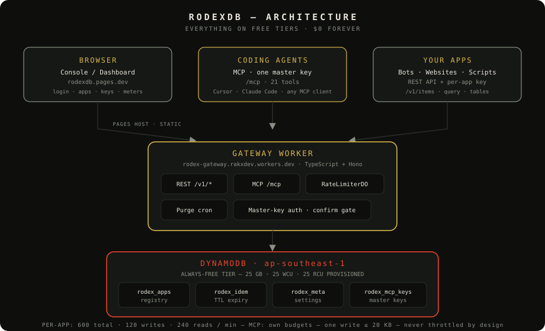
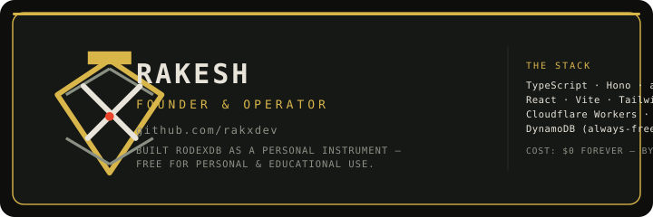

<p align="center">
  
</p>

<h1 align="center">RODEX&nbsp;DB</h1>

<h3 align="center">Your own database platform — per-app keys &amp; tables on DynamoDB, one clean API, <br/>every coding agent on MCP, all on the free tier. <em>$0 forever.</em></h3>

<p align="center">
  <a href="https://github.com/rakxdev/RodeX/actions/workflows/ci.yml"></a>
  
  
  
  
  <a href="https://www.npmjs.com/package/rodexdb"></a>
  <a href="https://www.npmjs.com/package/rodex-mcp"></a>
</p>

<p align="center">
  <a href="https://rodexdb.pages.dev"><b>LIVE CONSOLE</b></a> ·
  <a href="https://rodexdb.pages.dev/docs"><b>API REFERENCE</b></a> ·
  <a href="https://rodexdb.pages.dev/usage"><b>USAGE &amp; LIMITS</b></a> ·
  <a href="docs/mcp.md"><b>MCP FOR AGENTS</b></a>
</p>

<p align="center">
  <a href="https://deploy.workers.cloudflare.com/?url=https://github.com/rakxdev/RodeX"></a>
</p>

---

## Architecture



---

## Table of Contents

1. [What is RodexDB](#what-is-rodexdb)
2. [Features](#features)
3. [How it stays free](#how-it-stays-free)
4. [Quick start — local](#quick-start--local)
5. [Deploy to Cloudflare — click-to-deploy](#deploy-to-cloudflare)
6. [Environment variables](#environment-variables)
7. [API & MCP — the developer surface](#api--mcp--the-developer-surface)
8. [Security invariants](#security-invariants)
9. [Testing & evidence](#testing--evidence)
10. [Documentation](#documentation)
11. [Credits](#credits)

---

## What is RodexDB

A **personal database gateway platform**: create apps, get isolated credentials, and every
app gets its own tables on DynamoDB through one documented HTTP API — plus a full
**MCP server** so any coding agent (Cursor, Claude Code, VS Code/Copilot, Gemini CLI, …)
can operate your data with one master key.

- **Per-app isolation** — every app has its own `rok_` key and its own
  `app_<id>_<name>` tables. Enforced at the storage layer: no cross-app access, ever.
- **One contract** — put / get / update / delete / query · idempotent writes
  (`request_id`, 24 h dedupe) · version-guarded updates (409 on conflict) · 20 KB items.
- **Strict limits you can watch** — single-point counters: the numbers the docs promise
  are the numbers enforced. 429s name their budget. LIVE METERS on every app.
- **MCP universal interface** — 21 tools, confirmation gate enforced server-side,
  master keys managed in the console (never by AI).
- **Free forever by design** — AWS always-free tier + Cloudflare free tier. No credit card.
  Every architectural number is derived from the free pools (see
  [docs/rate-limits.md](docs/rate-limits.md) and [docs/research-validation.md](docs/research-validation.md)).

---

## Features

| Capability | What you get |
|---|---|
| 🔑 **Per-app keys** | `rok_`-branded, hash-only at rest, shown once, 48 h view window, rotation |
| 🗂 **Per-app tables** | `app_<id>_<name>` physical isolation, 5 WCU/5 RCU, auto-provisioned |
| ✍️ **Items & queries** | put / get / update / delete / query with pagination, sk-prefix filters |
| 🔁 **Idempotency** | `request_id` dedupe with TTL auto-expiry (zero-cost) |
| 🛡 **Version guarding** | `expected_version` → 409 on conflict, never silent clobber |
| 📊 **Observability** | LIVE METERS per app: request budgets + storage (zero-cost peeks) |
| 🤖 **MCP for agents** | Streamable HTTP at `/mcp`, 21 tools, master keys, confirmation gate |
| 🚦 **Strict limits** | 600 total / 120 writes / 240 reads per app · 1000 platform · 60 admin — per minute |
| 👤 **Console** | React + Tailwind console: app board, key seals, live meters, MCP page |
| 🌐 **Public docs** | API reference, usage & limits, MCP manual — no login needed |

---

## How it stays free

```
AWS DynamoDB always-free tier   → 25 GB storage · 25 WCU · 25 RCU provisioned (ap-southeast-1)
Cloudflare Workers free plan    → gateway worker + Durable Object counters + 1/min purge cron
Cloudflare Pages free plan      → the console, static assets
```

The math is the product: every budget is *derived from* the free pools and enforced
strictly — one write ≤ 20 KB, per-app writes ≤ 120/min (~2/s), so the gateway never
asks DynamoDB for more than the free tier gives. **Never throttled by design.**
See [docs/rate-limits.md](docs/rate-limits.md) for the full math + live stress evidence.

---

## Quick start — local

> Zero AWS needed: the gateway runs against an in-memory mock.

```bash
git clone https://github.com/rakxdev/RodeX.git && cd RodeX
npm install
cp gateway/.dev.vars.example gateway/.dev.vars   # set ADMIN_PASSWORD (dev)
npm run dev                                       # gateway on :8787 (mock storage)
```

```bash
npm test                                          # 182 tests, mock storage
npm run typecheck                                 # strict TS
npm run lint                                      # eslint
cd dashboard && npm run dev                       # the console locally
```

---

## Use it — 3 ways

| Way | For | How |
|---|---|---|
| **REST** | any language, curl, your own code | `<gateway>/v1/*` with `X-App-Id` + `X-Api-Key` — [full reference](https://rodexdb.pages.dev/docs) |
| **MCP** | coding agents | `<gateway>/mcp` with a master key — [docs/mcp.md](docs/mcp.md) |
| **SDK** | TypeScript bots | `npm install rodexdb` — [packages/rodexdb](packages/rodexdb) · wrapper for local agents: `npx -y rodex-mcp` — [packages/rodex-mcp](packages/rodex-mcp) |

Both packages are **URL-agnostic**: point them at your own deployment
(`--url` / `url:`), or at the live instance for a quick start. Full
walkthrough (deploy your own → credentials → code): **[docs/developers.md](docs/developers.md)** ·
runnable example: **[examples/sdk-bot.mjs](examples/sdk-bot.mjs)**.
Personal & educational use — see [LICENSE](LICENSE).

---

## Deploy to Cloudflare

Two parts, deployed separately — **backend** (the gateway Worker: API + MCP)
and **frontend** (the console on Pages). This section walks both, including
which credentials go where and how the two connect.

### 1 · BACKEND — the gateway Worker

#### ⚡ Click-to-deploy (fastest)

[](https://deploy.workers.cloudflare.com/?url=https://github.com/rakxdev/RodeX)

The button clones this repo into **your** Cloudflare account and walks you
through every credential as a form, each with a description of exactly what
to paste (defined in `gateway/package.json` → `cloudflare.bindings`).

**Credentials it will ask for — get them ready first:**

| Credential | Where to get it |
|---|---|
| `AWS_ACCESS_KEY_ID` + `AWS_SECRET_ACCESS_KEY` | **Required.** Create the IAM user `rodex-gateway` with the least-privilege policy in [docs/aws-setup.md](docs/aws-setup.md) (~4 min). Tables auto-provision on first use — nothing else to create. |
| `ADMIN_PASSWORD` | Your console password (≥ 12 chars). Changeable later in-app. |
| `SESSION_SECRET` | Random ≥ 24 chars: `openssl rand -hex 32`. |
| `GITHUB_CLIENT_ID` + `GITHUB_CLIENT_SECRET` | **Optional** — console GitHub login. Create an OAuth app at github.com/settings/developers; callback = `<your-backend-url>/v1/auth/github/callback`. Leave empty for password-only login. |

When the deploy finishes you get **your backend URL**: `https://<name>.workers.dev`.

#### Manual (same thing, via CLI)

```bash
cd gateway
npx wrangler secret put ADMIN_PASSWORD      # your console password (min 12 chars)
npx wrangler secret put SESSION_SECRET      # openssl rand -hex 32
npx wrangler secret put AWS_ACCESS_KEY_ID   # from the IAM user (docs/aws-setup.md)
npx wrangler secret put AWS_SECRET_ACCESS_KEY
npx wrangler secret put GITHUB_CLIENT_ID    # optional — see table above
npx wrangler secret put GITHUB_CLIENT_SECRET
npx wrangler deploy
```

Note: pushing to `main` also auto-deploys via
[`.github/workflows/deploy.yml`](.github/workflows/deploy.yml) (PRs only —
`main` is protected by the `quality` gate).

### 2 · FRONTEND — the console on Cloudflare Pages

1. Cloudflare dashboard → **Workers & Pages → Create → Pages → Connect to Git**.
2. Pick this repo → build preset **Vite** → build command `npm run build`,
   output directory `dashboard/dist`.
3. Set the **one connection variable**: `VITE_GATEWAY_URL = <your backend URL>`.
4. Deploy → **your console URL**: `https://<project>.pages.dev`.

### 3 · Connecting frontend to backend (the contract)

Three values must agree — set them exactly like this:

| Who | Variable | Set to |
|---|---|---|
| Backend (`wrangler.toml [vars]`) | `DASHBOARD_ORIGIN` | your **Pages** URL (console) |
| Frontend build (Pages env) | `VITE_GATEWAY_URL` | your **backend** workers.dev URL |
| GitHub OAuth app (if used) | callback URL | `<backend>/v1/auth/github/callback` |

Then redeploy the backend once (`npx wrangler deploy`) so CORS knows the
console origin.

### 4 · Verify

Follow the live smoke script in [docs/testing.md §Live](docs/testing.md):
health → login → fabricate an app → key shown once → table → CRUD →
403 cross-app → 429. The public docs are always live at
rodexdb.pages.dev/docs and rodexdb.pages.dev/usage.

---

## Environment variables

Full reference: **[docs/env.md](docs/env.md)**. Quick map:

| Secret (`wrangler secret put`) | What it is |
|---|---|
| `ADMIN_PASSWORD` | console fallback password (≥ 12 chars); changeable in-app |
| `SESSION_SECRET` | signs sessions + hashes keys (≥ 24 chars; rotating it is a big deal) |
| `GITHUB_CLIENT_ID` / `GITHUB_CLIENT_SECRET` | console GitHub OAuth |
| `AWS_ACCESS_KEY_ID` / `AWS_SECRET_ACCESS_KEY` | DynamoDB access (IAM user above) |

| Var (`wrangler.toml [vars]`) | What it is |
|---|---|
| `STORAGE` | `"mock"` (local) / `"aws"` (production) |
| `DASHBOARD_ORIGIN` | console origin for CORS + OAuth callbacks |

---

## API & MCP — the developer surface

- **REST** — full reference on the live site: [rodexdb.pages.dev/docs](https://rodexdb.pages.dev/docs)
  (or [docs/api.md](docs/api.md) + [docs/openapi.yaml](docs/openapi.yaml) in-repo).
  Base: `<gateway>/v1` · auth: `X-App-Id` + `X-Api-Key` · budgets and error codes
  documented with evidence.
- **MCP** — one endpoint, one master key, every agent: **[docs/mcp.md](docs/mcp.md)**.
  21 tools (8 read + 13 mutation), server-enforced confirmation gate, own budgets.

```text
GET  /v1/health                    → ok
POST /v1/table/create              → your table, 5 WCU/5 RCU, registered
POST /v1/item/put                  → idempotent write, version starts at 1
POST /v1/item/get                  → read (sk defaults to "~")
POST /v1/query                     → pk + sk_prefix + pagination
POST /v1/admin/…                   → console surface (session auth)
POST /mcp                          → MCP (JSON-RPC, master-key auth)
```

---

## Security invariants

> Tested and non-negotiable — see the test suite.

- App tables are always `app_<app_id>_<name>`; unowned tables → **403, no existence leak**
- Keys stored as **HMAC hashes**; shown once; rotate instantly revokes; 48 h encrypted
  view window; MCP keys viewable anytime, **no rotation** (delete + recreate)
- MCP mutations require **`confirmed: true`** — enforced server-side, never by prompt
- Idempotency via `request_id` (24 h, TTL-expired); version-guarded updates (409)
- 20 KB write cap → always inside the free WCU budget
- Secrets only via `wrangler secret`; logs never contain keys or payloads
- Sessions: HMAC-signed, 12 h, dual-channel (cookie + bearer) — works in every browser
- `npm audit` — 0 vulnerabilities; CI runs security audit on every push

---

## Testing & evidence

- **182 tests** across the gateway: auth matrix, storage contract (mock + AWS marshaling),
  registry lifecycle, strict rate budgets + DO atomicity, full-stack HTTP, admin surface,
  **MCP integration over real JSON-RPC** (auth, gate refusals, every tool, write-burst stress,
  the MCP≡REST wire-shape contract test), batch writes (size cap, all-or-nothing validation,
  per-item results, weighted budget accounting), batch/get + atomic counters + row TTL
- **Live stress evidence**: write burst 250 → exactly 120 allowed / 130 × 429 naming the
  budget; reads trip at #241; admin at 60 — the numbers the docs promise are the numbers
  enforced ([docs/rate-limits.md](docs/rate-limits.md))
- Every release: `quality` gate = lint → typecheck → tests → bundle → audit (green-blocked)

---

## Documentation

| Doc | What it covers |
|---|---|
| [SPEC.md](SPEC.md) · [PRODUCT.md](PRODUCT.md) | product spec, decisions |
| [docs/api.md](docs/api.md) · [docs/openapi.yaml](docs/openapi.yaml) | the full contract |
| [docs/rate-limits.md](docs/rate-limits.md) | capacity math + stress evidence |
| [docs/mcp.md](docs/mcp.md) | the MCP universal interface |
| [docs/env.md](docs/env.md) | every variable & secret |
| [docs/aws-setup.md](docs/aws-setup.md) | IAM + auto-provisioning |
| [docs/testing.md](docs/testing.md) | tests + live runbook |
| [docs/developers.md](docs/developers.md) | SDK + MCP bridge guide for your own code |
| [docs/ci-cd.md](docs/ci-cd.md) | gates, deploy, rollback |
| [docs/research-validation.md](docs/research-validation.md) | verified sources |
| [docs/faq.md](docs/faq.md) | plain-language FAQ (meters, budgets, TTL, license) |
| [docs/decisions/](docs/decisions/) | ADR-001 … ADR-006 |
| [CHANGELOG.md](CHANGELOG.md) | shipped history |
| [tasks/](tasks/) | plans & task lists |

Live: **console** rodexdb.pages.dev · **docs** rodexdb.pages.dev/docs ·
**usage & limits** rodexdb.pages.dev/usage.

---

## Credits

<p align="center">
  <a href="https://github.com/rakxdev">
    
  </a>
</p>

**RodexDB is built and operated by [Rakesh (rakxdev)](https://github.com/rakxdev)**
— a one-person instrument-packet project, free for personal & educational use.

- **Stack**: TypeScript · Hono · aws4fetch · Zod · React · Vite · Tailwind v4 ·
  Framer Motion · the official MCP TypeScript SDK · Cloudflare Workers/Pages/Durable
  Objects · AWS DynamoDB.
- **Fuel**: the AWS always-free tier and the Cloudflare free plan — the product exists
  *because* $0 is an architectural constraint, not a budget line.

## License

[RODEXDB PERSONAL-USE LICENSE](LICENSE) — free for **personal and educational use**:
read it, learn from it, run it, modify it. **Commercial use is strictly forbidden.**
